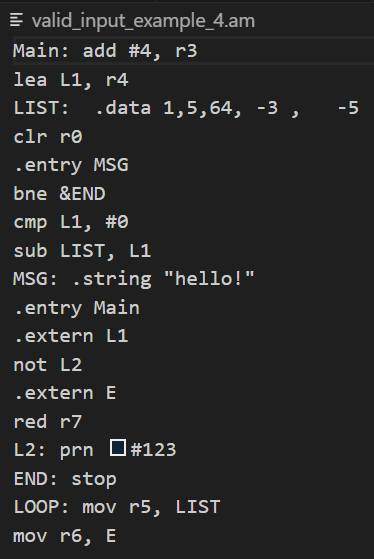
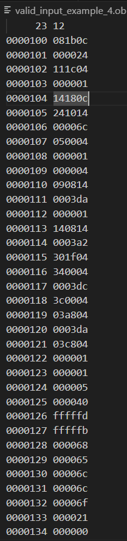
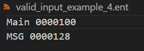
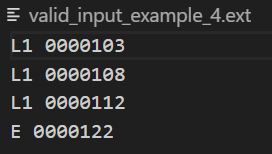

# Assembler – C Project for Systems Programming (Course 20465 @ The Open University)

This project is a three-pass assembler written in C, designed to convert assembly language source files into machine code for an imaginary 24-bit CPU with 21-bit memory.

## 📌 Project Overview

The assembler processes assembly (.as) files in three main stages:

1. **Pre-Assembler**: Handles **macro definitions and expansions** and Outputs an intermediate file (`.am`) containing expanded assembly code with no macro definitions remaining.
1. **First Pass**: Scans the expanded source code to **build a symbol table**, identifying labels and variables.
2. **Second Pass**: **Generates the machine code**, resolving addresses using the symbol table.

The output includes:

- `.am` (expanded assembly file) containing the assembly code after macro deployment.
- `.ob` (object file) containing the encoded code and data sections.
- `.ent` (entry file) listing entry symbols (intended for use in external files).
- `.ext` (external file) listing external symbols (imported from external files).

This project was developed as part of the "Lab in Systems Programming" course at The Open University (Course 20465).

## 🚀 Features

- **Two-Pass Assembly**: Efficiently handles labels and addresses.
- **Symbol/Memory Table Management**: Handles memory allocation for assembly symbols, variables and data.
- **Error Handling**: Provides meaningful error messages for debugging.
- **Modular Design**: Organized into multiple C files for maintainability.

## 🛠️ Getting Started

### Prerequisites

- C compiler (e.g., GCC)
- Make utility

### Installation

1. Clone the repository:

   ```bash
   git clone https://github.com/ice-age-4/Assembler.git
   ```

2. Navigate to the project directory:

```bash
cd Assembler
```

3. Build the project:

- On Linux / WSL:

```bash
make
```

- On Windows (with GCC installed, e.g., via MinGW):

```bash
mingw32-make
```

This will compile the assembler and create the executable `assembler`.


### Usage

To assemble an assembly file:

```bash
./assembler <source_file_1> <source_file_2> ... <source_file_n>
```

This will generate the corresponding `.am`, `.ob`, `.ent`, and `.ext` files.

## 🧩 Example Runs

The following examples demonstrate how the assembler handles both valid and invalid input files.  
All screenshots were taken from real command-line runs.

---

### 🧾 File Not Found Example


### ❌ Invalid Input Example 1


### ❌ Invalid Input Example 2


### ❌ Invalid Input Example 3


### ✅ Valid Input Example 4 – Successful Run


### 🧾 Output Files from Successful Run

| Expanded Assembly (.am) | Object (.ob) | Entries (.ent) | Externals (.ext) |
|:-------------:|:--------------:|:----------------:|:----------------:|
|  |  |  |  |

> These files are automatically generated by the assembler for each valid source file.


## 📁 Project Structure

- `main.c`: Entry point of the assembler program.
- `Assembler.c` / `Assembler.h`: Core assembler logic.
- `Data.c` / `Data.h`: Management of the memory table for assembly variables and data.
- `Errors.c` / `Errors.h`: Error detection and reporting.
- `Files.c` / `Files.h`: File input/output operations.
- `Labels.c` / `Labels.h`: Label parsing and management.
- `LineParsing.c` / `LineParsing.h`: Individual line code parsing.
- `LinkedList.c` / `LinkedList.h`: Linked list implementations.
- `Macros.c` / `Macros.h`: Macro handling.
- `Operations.c` / `Operations.h`: Parsing assembly instructions.
- `Table.c` / `Table.h`: Generic table data structure management.
- `globals.h`: Global definitions and constants.
- `Makefile`: Simplifies building the project.
